**Install Angular Material**
`ng add @angular/material`

whenever we choose angular material css type should be in sass or scss

choose the Theme whatever you need

style.scss
@import '../node_modules/@angular/material/prebuilt-themes/azure-blue.css';

angular.json
  `"styles": [
              "@angular/material/prebuilt-themes/azure-blue.css",
              "src/styles.scss"
            ],`

# Template Driven Form
# login-form
ng g c  login-form 

# login-form.html
```html 
:{{ email }}
{{ password }}

<form action="" #loginForm="ngForm">
  <div class="form-group">
    <label>Enter Email</label>
    <input type="text" class="form-control"
     name="email" [(ngModel)]="email" />
  </div>
  <div class="form-group">
    <label>Enter Password</label>
    <input
      type="password"
      class="form-control"
      name="password"
      [(ngModel)]="password"
    />
  </div>
  <div>
    <button type="submit" 
    class="btn btn-primary">Submit</button>
  </div>
</form>
```
# login-form.component.ts
```Typescript
import { FormsModule } from '@angular/forms';
 imports: [FormsModule],
 export class LoginFormComponent {
  email: string = '';
  password: string = '';
}
```
# login-form.component.ts
```html
<form action="" (ngSubmit)="loginSubmitted(loginForm)" 
#loginForm="ngForm">
```
# login-form.component.ts
```Typescript
 loginSubmitted(loginForm: any) {
    console.log(loginForm.value);
  } 
```

# Reactive Form  DEmo
ng g c login-reactive-form

# Slide-toggle

if angular app is not a standalone in `app.module.ts`
```TypeScript
import { MatToolbarModule } from '@angular/material/toolbar';
import { MatSlideToggleModule } from '@angular/material/slide-toggle';
@NgModule({
  declarations: [AppComponent],
  imports: [
    BrowserModule,
    AppRoutingModule,
    MatToolbarModule,
    MatSlideToggleModule,
  ],
})
```

if app in in standalone mode you can import MatToolbarModule
and add in imports array
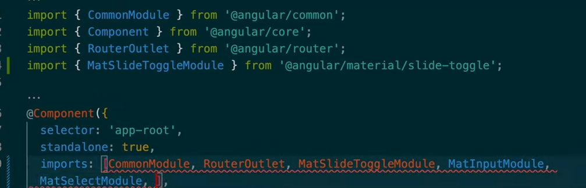
# app.component.html
<mat-toolbar>
  <span class="header-text">{{ title }}</span>
</mat-toolbar>
<mat-slide-toggle>Toggle me!</mat-slide-toggle>


# app.component.css
 mat-toolbar{
    display: flex;
    justify-content: center;
    background-color: paleturquoise;
}
.header-text{
    text-align: center;
    font-size: 34px;
    color:white;
} 
# output
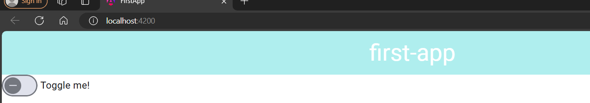


# MatForms Demo

# MatInput,MatSelect,MatDatePicker,MatNativeDate

# app.module.ts
    MatInputModule,
    MatSelectModule,
    MatDatepickerModule,
    MatNativeDateModule,
    ReactiveFormsModule,
# app.component.html
`form>mat-form-field>mat-label+input`
 above code create below model
 ```html
 <form action="">
  <mat-form-field appearance="fill">
    <mat-label>Enter your Name</mat-label>
    <input matInput placeholder="Name" type="text" required="" />
  </mat-form-field>

  <!--MatSelect -->
  <mat-form-field>
    <mat-label>Select your favourite food</mat-label>
    <mat-select>
      <mat-option value="1">Dosa</mat-option>
      <mat-option value="2">Pizza</mat-option>
      <mat-option value="3">Burger</mat-option>
    </mat-select>
  </mat-form-field>
  <mat-form-field>
    <mat-label>Select your DOB</mat-label>
    <input matInput [matDatepicker]="picker" required="" />
    <mat-datepicker-toggle matSuffix [for]="picker">
      <mat-datepicker #picker></mat-datepicker>
    </mat-datepicker-toggle>
  </mat-form-field>
</form>
```
output
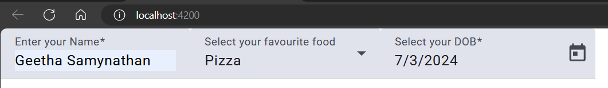

let us change the css
mat-form-field{
    width: 100%;
    display: flex;
} 

output
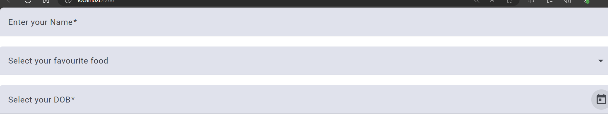

**app.component.css**
```css 
form{
    display: flex;
    justify-content: center; 
    align-items: center;
    flex-direction: column;
    gap: 20px;
} 

mat-form-field{
    width: 300px;
}
```
#output
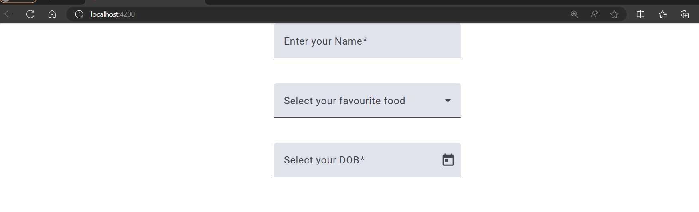

# Let us perform validation

.ts
```Typescript
import { Component, inject } from '@angular/core';
import { FormBuilder, Validators } from '@angular/forms';

@Component({
  selector: 'app-root',
  templateUrl: './app.component.html',
  styleUrl: './app.component.scss',
})
export class AppComponent {
  fb = inject(FormBuilder);
  form = this.fb.group({
    name: ['', [Validators.required, Validators.minLength(3)]],
    favouriteFood: [''],
    dateOfBirth: [''],
  });
  title = 'first-app';
}
```

.html
```html
<form action="" [formGroup]="form">
  <mat-form-field appearance="fill">
    <mat-label>Enter your Name</mat-label>
    <input matInput placeholder="Name" type="text" formControlName="name" />
    @if(form.get('name')?.hasError('required')&& form.get('name')?.touched){
    <mat-error>Name is Required</mat-error>
    } @if(form.get('name')?.hasError('minlength')&& form.get('name')?.touched){
    <mat-error>Name should have min 3 chars</mat-error>
    }
  </mat-form-field>
  <!--MatSelect -->
  <mat-form-field>
    <mat-label>Select your favourite food</mat-label>
    <mat-select formControlName="favouriteFood">
      <mat-option value="1">Dosa</mat-option>
      <mat-option value="2">Pizza</mat-option>
      <mat-option value="3">Burger</mat-option>
    </mat-select>
  </mat-form-field>
  <mat-form-field>
    <mat-label>Select your DOB</mat-label>
    <input
      matInput
      [matDatepicker]="picker"
      required=""
      formControlName="dateOfBirth"
    />
    <mat-datepicker-toggle matSuffix [for]="picker">
      <mat-datepicker #picker></mat-datepicker>
    </mat-datepicker-toggle>
  </mat-form-field>
</form>

```

# matsidenav,mattoolbar Modules

add new component as sidenav
ng g c sidenav

**app.module.ts**
MatToolbarModule,
MatSidenavModule,

sidenav.html
<mat-sidenav-container>
  <mat-sidenav mode="side" opened="true">
    <p>
      <a routerLink="/home">Home</a>
      <a routerLink="/about">About</a>
      <a routerLink="/contact">Contact</a>
    </p>
  </mat-sidenav>
  <mat-sidenav-content>
    <mat-toolbar color="primary">My App</mat-toolbar>
    <h1>Welcome to our application</h1>
  </mat-sidenav-content>
  <router-outlet></router-outlet>
</mat-sidenav-container>


**output**
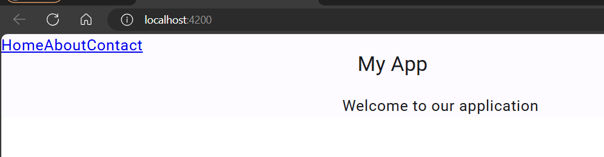

# let us add menu button for toggle
```html
<mat-sidenav-container>
  <mat-sidenav #sidenav mode="side" opened="true">
    <p>
      <a routerLink="/home">Home</a>
      <a routerLink="/about">About</a>
      <a routerLink="/contact">Contact</a>
    </p>
  </mat-sidenav>
  <mat-sidenav-content>
    <mat-toolbar color="primary">My App</mat-toolbar>
    <button mat-icon-button (click)="sidenav.toggle()">
      <mat-icon>menu</mat-icon>
    </button>
    <div>Welcome to our application</div>
  </mat-sidenav-content>
  <router-outlet></router-outlet>
</mat-sidenav-container>

```
# output
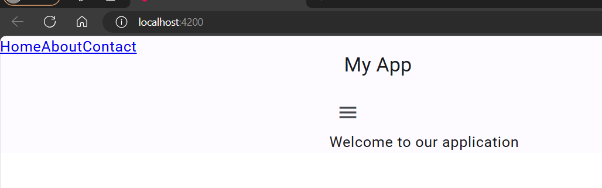

after click the menu button sidenav get toggle
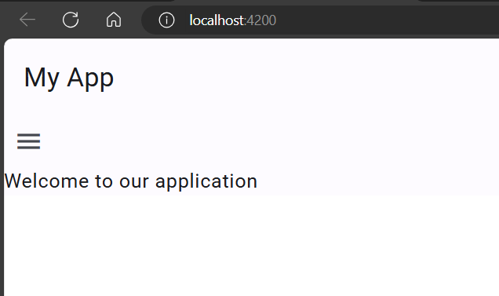

# postion attribute on mat-sidenav

<mat-sidenav #sidenav position="start" opened="true">

# Layout (angular-flex-layout)
`npm i @angular/flex-layout`

app.module.ts
import { FlexLayoutModule } from '@angular/flex-layout';
import { MatGridListModule } from '@angular/material/grid-list';

**create another component**
ng g c layout

layout.ts
```Typescript
export class LayoutComponent {
  tiles = [
    { text: 'header', cols: 3, rows: 1 },
    { text: 'side', cols: 1, rows: 2 },
    { text: 'section 1', cols: 1, rows: 1 },
    { text: 'section 2', cols: 2, rows: 1 },
    { text: 'footer', cols: 3, rows: 1 },
  ];
}
``
Layout.html

<mat-grid-list cols="3" rowHeight="100px" gutterSize="10px">
  @for(tile of tiles;track $index){
  <mat-grid-tile [colspan]="tile.cols" [rowspan]="tile.rows">{{
    tile.text
  }}</mat-grid-tile>
  }
</mat-grid-list>

Layout.css
mat-grid-tile{
    background-color: darkgray;
}

add routing as well in sidenav
sidenav.html
<a [routerLink]="['/layout']">Grid Layout</a>

app.routing.module.ts
 { path: 'layout', component: LayoutComponent },
output:
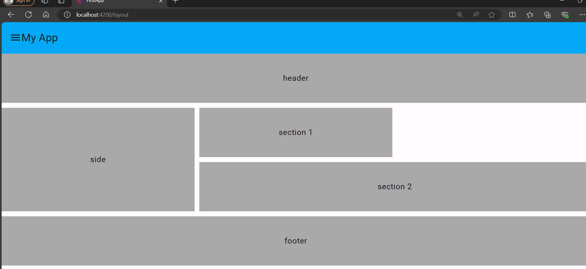

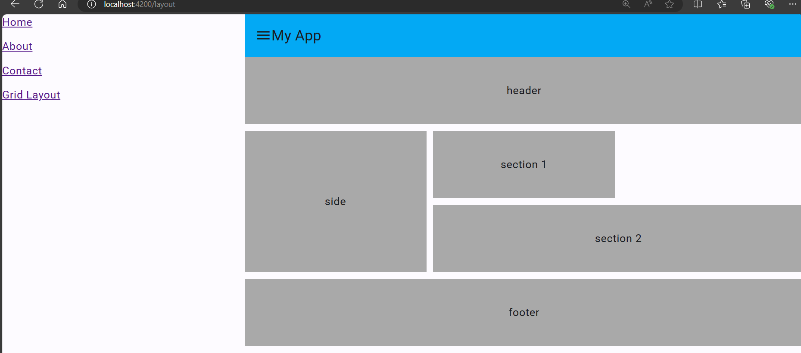


**Style.scss**
`@import '../node_modules/@angular/material/prebuilt-themes/pink-bluegrey.css';`

html, body { height: 100%; }
body { margin: 0; font-family: Roboto, "Helvetica Neue", sans-serif; }

$primary:#03A9F4;


# Mat-Table 
**App.module.ts**
import { MatTableModule } from '@angular/material/table';
import { MatSortModule } from '@angular/material/sort';
import { MatPaginatorModule } from '@angular/material/paginator';

ng g c tabledemo
`tabledemo.component.ts`
# table with title,pagination,sorting
`tabledemo.ts`
```
```TypeScript
import { Component, ViewChild } from '@angular/core';
import { MatPaginator, MatPaginatorModule } from '@angular/material/paginator';
import { MatSort, Sort } from '@angular/material/sort';
import { MatTableDataSource } from '@angular/material/table';
import { LiveAnnouncer } from '@angular/cdk/a11y';
export interface PeriodicElement {
  name: string;
  position: number;
  weight: number;
  symbol: string;
}

const ELEMENT_DATA: PeriodicElement[] = [
  { position: 1, name: 'Hydrogen', weight: 1.0079, symbol: 'H' },
  { position: 2, name: 'Helium', weight: 4.0026, symbol: 'He' },
  { position: 3, name: 'Lithium', weight: 6.941, symbol: 'Li' },
  { position: 4, name: 'Beryllium', weight: 9.0122, symbol: 'Be' },
  { position: 5, name: 'Boron', weight: 10.811, symbol: 'B' },
  { position: 6, name: 'Carbon', weight: 12.0107, symbol: 'C' },
  { position: 7, name: 'Nitrogen', weight: 14.0067, symbol: 'N' },
  { position: 8, name: 'Oxygen', weight: 15.9994, symbol: 'O' },
  { position: 9, name: 'Fluorine', weight: 18.9984, symbol: 'F' },
  { position: 10, name: 'Neon', weight: 20.1797, symbol: 'Ne' },
  // { position: 11, name: 'Hydrogen', weight: 1.0079, symbol: 'H' },
  // { position: 12, name: 'Helium', weight: 4.0026, symbol: 'He' },
  // { position: 13, name: 'Lithium', weight: 6.941, symbol: 'Li' },
  // { position: 14, name: 'Beryllium', weight: 9.0122, symbol: 'Be' },
  // { position: 15, name: 'Boron', weight: 10.811, symbol: 'B' },
  // { position: 16, name: 'Carbon', weight: 12.0107, symbol: 'C' },
  // { position: 17, name: 'Nitrogen', weight: 14.0067, symbol: 'N' },
  // { position: 18, name: 'Oxygen', weight: 15.9994, symbol: 'O' },
  // { position: 19, name: 'Fluorine', weight: 18.9984, symbol: 'F' },
  // { position: 20, name: 'Neon', weight: 20.1797, symbol: 'Ne' },
];
@Component({
  selector: 'app-tabledemo',
  templateUrl: './tabledemo.component.html',
  styleUrl: './tabledemo.component.css',
})
export class TabledemoComponent {
  displayedColumns: string[] = ['position', 'name', 'weight', 'symbol'];
  dataSource = new MatTableDataSource<PeriodicElement>(ELEMENT_DATA);

  @ViewChild(MatPaginator) paginator!: MatPaginator;
  @ViewChild(MatSort) sort!: MatSort;
  ngAfterViewInit() {
    this.dataSource.paginator = this.paginator;
    this.dataSource.sort = this.sort;
  }
  constructor(private _liveAnnouncer: LiveAnnouncer) {}
  announceSortChange(sortState: Sort) {
    if (sortState.direction) {
      this._liveAnnouncer.announce(`Sorted ${sortState.direction}ending`);
    } else {
      this._liveAnnouncer.announce('Sorting cleared');
    }
  }
}

```

```html
<div class="mat-elevation-z8">
  <table
    mat-table
    [dataSource]="dataSource"
    matSort
    (matSortChange)="announceSortChange($event)"
  >
    <!-- Position Column -->
    <ng-container matColumnDef="position">
      <th
        mat-header-cell
        *matHeaderCellDef
        mat-sort-header
        sortActionDescription="Sort by number"
      >
        No
      </th>
      <td mat-cell *matCellDef="let element">{{ element.position }}</td>
    </ng-container>

    <!-- Name Column -->
    <ng-container matColumnDef="name">
      <th
        mat-header-cell
        *matHeaderCellDef
        mat-sort-header
        sortActionDescription="Sort by name"
      >
        Name
      </th>
      <td mat-cell *matCellDef="let element">{{ element.name }}</td>
    </ng-container>

    <!-- Weight Column -->
    <ng-container matColumnDef="weight">
      <th
        mat-header-cell
        *matHeaderCellDef
        mat-sort-header
        sortActionDescription="Sort by weight"
      >
        Weight
      </th>
      <td mat-cell *matCellDef="let element">{{ element.weight }}</td>
    </ng-container>

    <!-- Symbol Column -->
    <ng-container matColumnDef="symbol">
      <th mat-header-cell *matHeaderCellDef>Symbol</th>
      <td mat-cell *matCellDef="let element">{{ element.symbol }}</td>
    </ng-container>

    <tr mat-header-row *matHeaderRowDef="displayedColumns"></tr>
    <tr mat-row *matRowDef="let row; columns: displayedColumns"></tr>
  </table>

  <mat-paginator
    [pageSizeOptions]="[5, 10, 20]"
    showFirstLastButtons
    aria-label="Select page of periodic elements"
  >
  </mat-paginator>
</div>

```

# Dialog and snack bar
for notifications
MatDialogModule

inject dialog(MatDialog);
ng g c mydialog

mydialog.html
<p>Open Dialog works</p>


tabledemo.html

above table tag
<button (click)="openDialog()">open dialog</button>

tabledemo.ts
dialog = inject(MatDialog);
  openDialog() {
    this.dialog.open(MydialogComponent);
  }

  add another component
  ng g c dialog-overview-example-dialog

dialog-overview-example-dialog.component.html

  <h2 mat-dialog-title>
  Hi
  <!-- {{ data.name }} -->
</h2>
<mat-dialog-content>
  <p>What's your favorite animal?</p>
  <mat-form-field>
    <mat-label>Favorite Animal</mat-label>
    <input matInput />
    <!-- [(ngModel)]="animal" -->
  </mat-form-field>
</mat-dialog-content>
<mat-dialog-actions>
  <button mat-button (click)="onNoClick()">No Thanks</button>
  <button mat-button cdkFocusInitial>Ok</button>
  <!-- [mat-dialog-close]="animal()" -->
</mat-dialog-actions>


dialog-overview-example-dialog.component.ts


import { Component, Inject, inject, model } from '@angular/core';
import { MAT_DIALOG_DATA, MatDialogRef } from '@angular/material/dialog';
import { MydialogComponent } from '../mydialog/mydialog.component';

@Component({
  selector: 'app-dialog-overview-example-dialog',
  templateUrl: './dialog-overview-example-dialog.component.html',
  styleUrl: './dialog-overview-example-dialog.component.css',
})
export class DialogOverviewExampleDialogComponent {
  //constructor(@Inject(MAT_DIALOG_DATA) public DialogData: any) { }
  readonly dialogRef = inject(MatDialogRef<MydialogComponent>);
  // readonly data = inject<DialogData>(MAT_DIALOG_DATA);
  // readonly animal = model(this.data.animal);

  onNoClick(): void {
    this.dialogRef.close();
  }
}


tabledemo.ts
dialog = inject(MatDialog);
  openDialog() {
    this.dialog.open(DialogOverviewExampleDialogComponent);
  }

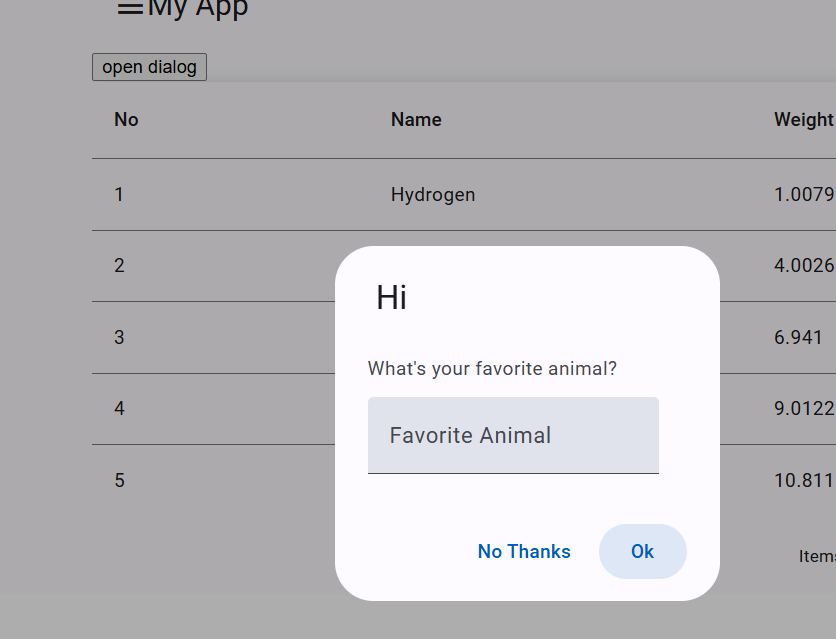