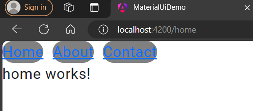

ng g c route-demo
ng g c home
ng g c about
ng g c contact

goto app.routes.ts
```TypeScript
import { Routes } from '@angular/router';
import { HomeComponent } from './home/home.component';
import { AboutComponent } from './about/about.component';
import { ContactComponent } from './contact/contact.component';

export const routes: Routes = [
  { path: 'home', component: HomeComponent },
  { path: 'about', component: AboutComponent },
  { path: 'contact', component: ContactComponent },
];
```
goto route-demo.component.html
<div>
  <p><a routerLink="/home">Home</a></p>
  <p><a routerLink="/about">About</a></p>
  <p><a routerLink="/contact">Contact</a></p>
</div>

route-demo.component.ts
import { RouterLink } from '@angular/router';
@Component({
  imports: [RouterLink],  
})
export class RouteDemoComponent {}

app.component.html
<app-route-demo></app-route-demo>
<router-outlet></router-outlet>
goto app.routes



 # add below line in routes.ts
 ```TypeScript
  { path: '', redirectTo: '/home', pathMatch: 'full' },

  ```

  ng g c errr-page

  error-page.component.html
  <h1 style="color: red">The requested url is inCorrect!..</h1>
<p>Kindly check the URL</p>

app.routes.ts
```Typescript
  { path: '**', component: ErrrPageComponent },
  ```