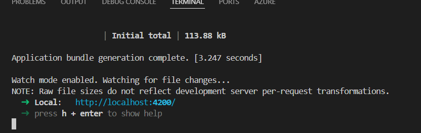

`node --version (or) node -v`

npm -v

**to install angular globally**
npm install -g @angular/cli

**to check angular version**
ng version

**to create a new angular application**
ng new first-angular-app 

ng new first-app --no-standalone
sass
ssr ==>yes

# Folder struncture of Angular


# to run angular application
ng s
ng serve



ng s -o


# app.component.ts
```Typescript
title = 'first-angular-app';
  fname: string = 'Geetha';
  lname: string = 'Eswar';
  ```
  # app.component.html
```html
<h1>Welcome to first angular app</h1>

<!-- One-way bindging using interpolation -->
<h3>{{ title }}</h3>
<p>{{ fname }}</p>
<p>{{ lname }}</p>
```

```TypeScript
 showButton: boolean = true;
  onButtonClick() {
    this.showButton = !this.showButton;
  }
```
<!-- Event Binding-->
<button (click)="onButtonClick()">
  {{ showButton ? "Hide" : "show" }}
</button>

<!-- Property Binding -->

<div [contentEditable]="isEditable"></div>

ts file
```TypeScript
itemImageUrl =
    'https://images.unsplash.com/photo-1722111627062-57cd2cda63df?q=80&w=1887&auto=format&fit=crop&ixlib=rb-4.0.3&ixid=M3wxMjA3fDB8MHxwaG90by1wYWdlfHx8fGVufDB8fHx8fA%3D%3D';
  altText = 'sample Image';
  isEditable=true;
  ```
.scss
  img{
    height: 600px;
    width: 600px;
}

# Two-way binding

app.module.ts
import { FormsModule } from '@angular/forms';
imports: [BrowserModule, AppRoutingModule, FormsModule],

app.component.ts
  fname: string = 'Geetha';
  
  app.component.html  
  <form action="">
  <label for="">Enter the Name</label>
  <input type="text" name="fname" 
  (onChange)="fnameChange($event)" [(ngModel)]="fname" />
  <p>{{ fname }}</p>
</form>

output


how to create new component usig angular CLI
ng g c product-list


# product-list.component.ts
  products = ['Product 1', 'Product 2', 'Product 3'];

# product-list.component.html
```html
<p>product-list works!</p>
<ol>
  <li>{{ products[0] }}</li>
  <li>{{ products[1] }}</li>
  <li>{{ products[2] }}</li>
</ol>

<!-- simplest form -->
<ol>
  <li *ngFor="let product of products">{{ product }}</li>
</ol>

```


# Let us perform with more data

product-list.component.ts
```TypeScript
products: any[] = [
    {
      productId: 'P101',
      productName: 'Lamborghini Gallardo Spyder',
      categoryId: 1,
      price: 18000000,
      quantityAvailable: 10,
    },
    {
      productId: 'P102',
      productName: 'Ben Sherman Mens Necktie Silk Tie',
      categoryId: 2,
      price: 1847,
      quantityAvailable: 20,
    },
    {
      productId: 'P103',
      productName: 'BMW Z4',
      categoryId: 1,
      price: 6890000,
      quantityAvailable: 10,
    },
    {
      productId: 'P104',
      productName: 'Samsung Galaxy S4',
      categoryId: 3,
      price: 38800,
      quantityAvailable: 100,
    },
  ];
  ```
  # product-list.component.html
```html
<button class="btn btn-primary">click</button>
<table class="table table-hover table-dark">
  <thead>
    <tr>
      <th scope="col">Product Id</th>
      <th scope="col">Product Name</th>
      <th scope="col">Product Price</th>
      <th scope="col">Stcok</th>
    </tr>
  </thead>
  <tbody>
    <tr *ngFor="let product of products">
      <td>{{ product.productId }}</td>
      <td>{{ product.productName }}</td>
      <td>{{ product.price }}</td>
      <td>{{ product.quantityAvailable }}</td>
    </tr>
  </tbody>
</table>
```
npm i bootstrap

goto style.css
```css
@import "../node_modules/bootstrap//dist/css/bootstrap.min.css";
```
angular.json
```json
"styles": [
              "../node_modules/bootstrap//dist/css/bootstrap.min.css",
              "src/styles.scss"
            ],
```


# whenever products array is empty we should show the table with only heading

```html
<div *ngIf="products.length > 0">
  <table class="table table-hover table-dark">
    <thead>
      <tr>
        <th scope="col">Product Id</th>
        <th scope="col">Product Name</th>
        <th scope="col">Product Price</th>
        <th scope="col">Stcok</th>
      </tr>
    </thead>
    <tbody>
      <tr *ngFor="let product of products">
        <td>{{ product.productId }}</td>
        <td>{{ product.productName }}</td>
        <td>{{ product.price }}</td>
        <td>{{ product.quantityAvailable }}</td>
      </tr>
    </tbody>
  </table>
</div>
<div *ngIf="products.length === 0">
  <p>No Products Available</p>
</div>
```

in the above example we hard coded all values in product-list.component.ts

Thats not good practice let us keep product properties in interfaces

Rightclick src==> add new folder(interfaces)==>add new file==>Product.ts
```Typescript
export interface IProduct {
  productId: string;
  productName: string;
  categoryId: number;
  price: number;
  quantityAvailable: number;
}
```

product-list.component.ts
```Typescript
import { Component } from '@angular/core';
import { IProduct } from '../../interfaces/product';
@Component({
  selector: 'app-product-list',
  templateUrl: './product-list.component.html',
  styleUrl: './product-list.component.scss',
})
export class ProductListComponent {
  //products = ['Product 1', 'Product 2', 'Product 3'];
  products: IProduct[] =[] ;
  ngOnInit() {
    this.products = [
      {
        productId: 'P101',
        productName: 'Lamborghini Gallardo Spyder',
        categoryId: 1,
        price: 18000000,
        quantityAvailable: 10,
      },
      {
        productId: 'P102',
        productName: 'Ben Sherman Mens Necktie Silk Tie',
        categoryId: 2,
        price: 1847,
        quantityAvailable: 20,
      },
      {
        productId: 'P103',
        productName: 'BMW Z4',
        categoryId: 1,
        price: 6890000,
        quantityAvailable: 10,
      },
      {
        productId: 'P104',
        productName: 'Samsung Galaxy S4',
        categoryId: 3,
        price: 38800,
        quantityAvailable: 100,
      },
    ];
  }
}
```

create another interface Icategory
```TypeScript
export interface ICategory {
  categoryId: number;
  categoryName: string;
}

```

product-list.component.ts
```Typescript
import { Component } from '@angular/core';
import { IProduct } from '../../interfaces/product';
import { ICategory } from '../../interfaces/category';
@Component({
  selector: 'app-product-list',
  templateUrl: './product-list.component.html',
  styleUrl: './product-list.component.scss',
})
export class ProductListComponent {
  //products = ['Product 1', 'Product 2', 'Product 3'];
  products: IProduct[] = [];
  categories: ICategory[] = [];
  filteredProducts: IProduct[] = [];
  ngOnInit() {
    this.categories = [
      { categoryId: 1, categoryName: 'Motors' },
      { categoryId: 2, categoryName: 'Tablets' },
      { categoryId: 3, categoryName: 'Laptops' },
    ];
    this.products = [
      {
        productId: 'P101',
        productName: 'Lamborghini Gallardo Spyder',
        categoryId: 1,
        price: 18000000,
        quantityAvailable: 10,
      },
      {
        productId: 'P102',
        productName: 'Ben Sherman Mens Necktie Silk Tie',
        categoryId: 2,
        price: 1847,
        quantityAvailable: 20,
      },
      {
        productId: 'P103',
        productName: 'BMW Z4',
        categoryId: 1,
        price: 6890000,
        quantityAvailable: 10,
      },
      {
        productId: 'P104',
        productName: 'Samsung Galaxy S4',
        categoryId: 2,
        price: 38800,
        quantityAvailable: 100,
      },
      {
        productId: 'P104',
        productName: 'Lenova',
        categoryId: 3,
        price: 98800,
        quantityAvailable: 10,
      },
      {
        productId: 'P104',
        productName: 'HP',
        categoryId: 3,
        price: 78800,
        quantityAvailable: 50,
      },
    ];
    this.filteredProducts = this.products;
  }
  searchProductByCategory(categoryId: string) {
    this.filteredProducts = this.products;

    if (categoryId == '0') {
      this.filteredProducts = this.products;
    } else {
      this.filteredProducts = this.products.filter(
        (prod) => prod.categoryId.toString() == categoryId
      );
    }
  }
}
```
product-list.component.html
```html
<label for="catergories">Choose the category</label>
<select name="catergories" id="catergories"  #categorydrop
(change)="searchProductByCategory(categorydrop.value)">
  <option value="0">All Categories</option>
  <option *ngFor="let category of categories" value="{{ category.categoryId }}">
    {{ category.categoryName }}
  </option>
</select>

<div *ngIf="products.length > 0">
  <table
    class="table table-hover table-dark"
    *ngIf="filteredProducts && filteredProducts.length"
  >
    <thead>
      <tr>
        <th scope="col">Product Id</th>
        <th scope="col">Product Name</th>
        <th scope="col">Product Price</th>
        <th scope="col">Stcok</th>
      </tr>
    </thead>
    <tbody>
      <tr *ngFor="let product of filteredProducts">
        <td>{{ product.productId }}</td>
        <td>{{ product.productName }}</td>
        <td>{{ product.price }}</td>
        <td>{{ product.quantityAvailable }}</td>
      </tr>
    </tbody>
  </table>
</div>
<div *ngIf="products.length == 0">
  <p>No Products Available</p>
</div>
```


# Let us implement Search functionality using input type
product-list.component.ts
```TypeScript
 onEnter(event: any) {
    console.log(`Event value in onEnter ${event.target.value}`);
    if (event.target.value) {
      this.filteredProducts = this.products.filter((prod) =>
        prod.productName
          .toLowerCase()
          .includes(event.target.value.toLowerCase())
      );
    } else {
      this.filteredProducts = this.products;
    }
  }
  ```
product-list.component.html
```html
<div>
  <div class="float-start">
    <label for="searchText">
      <input type="text" name="searchText" 
      (keyup.enter)="onEnter($event)" />
    </label>
  </div>
  <div class="float-end">
    <label for="catergories">Choose the category</label>
    <select
      name="catergories"
      id="catergories"
      #categorydrop
      (change)="searchProductByCategory(categorydrop.value)"
    >
      <option value="0">All Categories</option>
      <option
        *ngFor="let category of categories"
        value="{{ category.categoryId }}"
      >
        {{ category.categoryName }}
      </option>
    </select>
  </div>
</div>
```