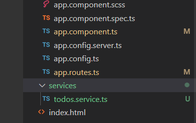
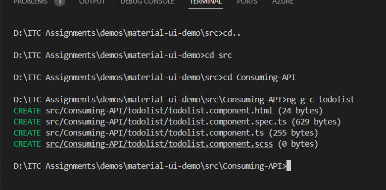
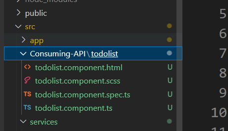
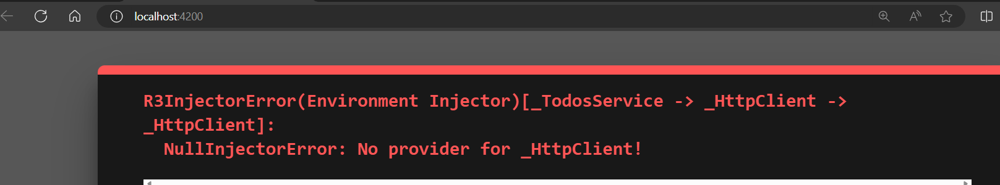
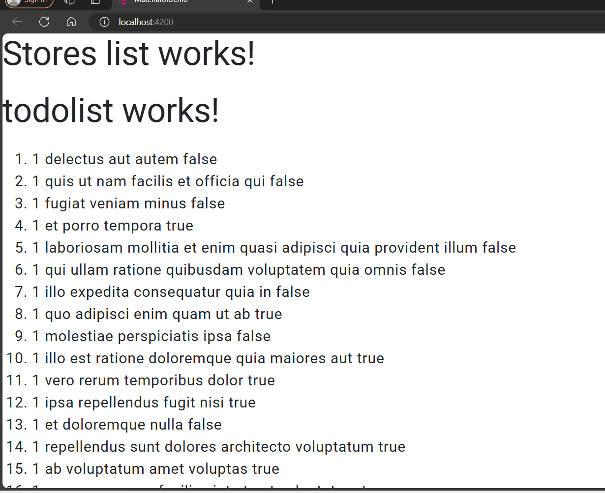

Create a new Service

right click ==> on src=> New Folder (services) ==> in terminal==> cd src==> cd services
` ng g s todos`
 

# todos.service.ts
```TypeScript
 import { Injectable } from '@angular/core';
import { HttpClient } from '@angular/common/http';
@Injectable({
  providedIn: 'root',
})
export class TodosService {
  constructor(private http: HttpClient) {}

  getAllTodos() {
    return this.http.get('https://jsonplaceholder.typicode.com/todos');
  }
}


```

create newfolder ==> in src==> consuming-API==> in terminal==>cd src
cd consuming-API==>
ng g c todolist





# todolist.component.ts
```Typescript
import { Component } from '@angular/core';
import { TodosService } from '../../services/todos.service';
import { HttpClient } from '@angular/common/http';
@Component({
  selector: 'app-todolist',
  standalone: true,
  imports: [],
  templateUrl: './todolist.component.html',
  styleUrl: './todolist.component.scss',
})
export class TodolistComponent {
  data: any;
  constructor(private todoService: TodosService) {}

  ngOnInit() {
    this.todoService.getAllTodos().subscribe((response) => {
      this.data = response;
    });
  }
}
```
# todolist.component.html
```html
<p>todolist works!</p>
<ol>
  @for(todo of data;track todo){
  <li>{{ todo.userId }} {{ todo.title }} {{ todo.completed }}</li>
  }
</ol>
```

Run application. we will get below error



to rectify the above error

goto app.config.ts
```Typescript
import { ApplicationConfig, provideZoneChangeDetection } from '@angular/core';
import { provideRouter } from '@angular/router';

import { routes } from './app.routes';
import { provideClientHydration } from '@angular/platform-browser';
import { provideAnimationsAsync } from '@angular/platform-browser/animations/async';
==import { provideHttpClient } from '@angular/common/http';==

export const appConfig: ApplicationConfig = {
  providers: [provideZoneChangeDetection({ eventCoalescing: true }), 
    provideRouter(routes), provideClientHydration(), 
    provideAnimationsAsync(),==provideHttpClient()==]
};

```
just highlighting the lines we added in app.config.ts as shown above
add line 75 ==>`import { provideHttpClient } from '@angular/common/http';`
add ==> provideHttpClient()




# create another service for Store CRUD operation
 create  interfaces folder in app folder==> store.ts
 ```TypeScript
 export interface Store {
  id: number;
  storeName: 'string';
  location: 'string';
}
```
in terminal cd src==> cd services
ng g s store
```TypeScript
import { inject, Injectable } from '@angular/core';
import { Store } from '../interfaces/store';
import { HttpClient } from '@angular/common/http';
import { catchError, lastValueFrom, Observable, of, tap } from 'rxjs';
@Injectable({
  providedIn: 'root',
})
export class StoreService {
  //http=inject(HttpClient);

  constructor(private http: HttpClient) {}
  // way :1
  getStores() {
    return this.http.get('http://localhost:5232/api/Stores');
  }
```

 app folder==> create a new folder stores-crud==> with in that add new component
D:\ITC Assignments\demos\material-ui-demo\src\app\stores-crud>
`ng g c storelist`


in storelistcomponent.ts
```Typescript
import { Component } from '@angular/core';
import { Store } from '../../../interfaces/store';
import { StoreService } from '../../../services/store.service';
@Component({
  selector: 'app-storelist',
  standalone: true,
  imports: [],
  templateUrl: './storelist.component.html',
  styleUrl: './storelist.component.scss',
})
export class StorelistComponent {
  stores: any;
  constructor(private storeService: StoreService) {}
  ngOnInit() {
    this.loadStores();
  }
  loadStores() {
    this.storeService.getStores().subscribe((data) => {
      this.stores = data;
    });
  }
}

```

storelist.component.html
 ```html
 <table class="table table-bordered">
  <thead>
    <tr>
      <td>id</td>
      <td>Name</td>
      <td>location</td>
    </tr>
  </thead>
  <tbody>
    @for(store of stores;track store){
    <tr>
      <td>{{ store.id }}</td>
      <td>{{ store.storeName }}</td>
      <td>{{ store.location }}</td>
    </tr>
    }
  </tbody>
</table>

```

storeservice.ts
```TypeScript
import { Injectable } from '@angular/core';
import { HttpClient } from '@angular/common/http';
import { catchError, Observable, of, tap } from 'rxjs';
import { Store } from '../interfaces/store';
import { error } from 'console';
@Injectable({
  providedIn: 'root',
})
export class StoreService {
  constructor(private http: HttpClient) {}

  //way 2
  getStores(): Observable<Store[]> {
    return this.http.get<Store[]>('http://localhost:5232/api/Stores').pipe(
      tap((_) => console.log('Stores fetched')),
      catchError(this.handleError<Store[]>('getStores', []))
    );
  }

  private handleError<T>(operation = 'operation', result?: T) {
    return (error: any): Observable<T> => {
      console.error(error);
      console.log(`${operation}  failed ${error.message}`);
      return of(result as T);
    };
  }
}


```

# way 3 in storeService.ts
```TypeScript
//way: 3 using async await

  async getStores() {
    try {
      return await lastValueFrom(
        this.http.get('http://localhost:5232/api/Stores')
      );
    } catch (e) {
      console.log(e);
      return null;
    }
  }
  ```

  #  Storelist.component.ts
  ```Typescript
import { Component } from '@angular/core';
import { Store } from '../../../interfaces/store';
import { StoreService } from '../../../services/store.service';
import { AddStoreComponent } from '../add-store/add-store.component';
@Component({
  selector: 'app-storelist',
  standalone: true,
  imports: [AddStoreComponent],
  templateUrl: './storelist.component.html',
  styleUrl: './storelist.component.scss',
})
export class StorelistComponent {
  stores: any;
  constructor(private StoreService: StoreService) {
    // this.loadStores();
  }
  ngOnInit() {}
  async loadStores() {
    this.stores = await this.StoreService.getStores();
  }
}

  
  ```


# for Post Method

in storeService.ts
```TypeScript
  addNewStore(data: any): Observable<any> {
    return this.http.post('http://localhost:5232/api/Stores', data);
  }
  ```

  under store-crud folder 
  ng g c addStore

  addStore.component.ts
```Typescript
import { Component, inject } from '@angular/core';
import { Store } from '../../../interfaces/store';
import { StoreService } from '../../../services/store.service';
import { FormBuilder, Validators } from '@angular/forms';
import { MatInputModule } from '@angular/material/input';
import { ReactiveFormsModule } from '@angular/forms';

@Component({
  selector: 'app-add-store',
  standalone: true,
  imports: [MatInputModule, ReactiveFormsModule],
  templateUrl: './add-store.component.html',
  styleUrl: './add-store.component.scss',
})
export class AddStoreComponent {
  storeId: any;
  store: Store = {
    id: 0,
    storeName: '',
    location: '',
  };
  constructor(private storeService: StoreService) {}
  fb = inject(FormBuilder);
  storeForm = this.fb.group({
    storeName: [''],
    location: [''],
  });
  addStore(stateForm: any) {
    const data = {
      storeName: this.storeForm.get('storeName')?.value,
      location: this.storeForm.get('location')?.value,
    };
    this.storeService
      .addNewStore(data)
      .subscribe((res) => (this.storeId = res));
  }
}

```
addStore.component.html 
```html
<h1>Add New Store</h1>
<form action="" [formGroup]="storeForm">
  <mat-label>Store Name</mat-label>
  <input
    matInput
    name="name"
    formControlName="storeName"
    required=""
    type="text"
  />
  <mat-label>Location</mat-label>
  <input
    matInput
    name="name"
    formControlName="location"
    required=""
    type="text"
  />

  <button (click)="addStore(storeForm)">Add</button>
  <!-- <button flat-button (click)="addStore(storeForm.value)">Basic</button> -->
</form>

```
